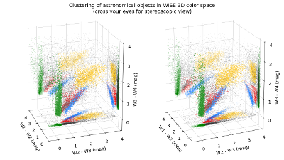

# wise3Dstereoscopic
Stereoscopic view of the clustering of astronomical objects in WISE 3D color space

**Author:** Robert Nikutta

**Title:** Clustering of astronomical objects in WISE 3D color space

**Based on:** Nikutta, Hunt-Walker, Ivezic, Nenkova, Elitzur, *'The
  meaning of WISE colours - I. The Galaxy and its satellites', MNRAS
  442, 3361-3379 (2014)*

[Paper at MNRAS](http://dx.doi.org/10.1093/mnras/stu1087)

[Paper on ADS](http://adsabs.harvard.edu/abs/2014MNRAS.442.3361N)

[Video on vimeo](https://vimeo.com/124757575)


## Synopsis

This stereoscopic plot (cross your eyes!) shows the distribution of
different types of astronomical objects in the 3D color space of the
WISE spacecraft (Wide-field Infrared Survey Explorer). Several classes
of objects are identified with differently colored dots. In
traditional 2D color-color plots clusters can overlap, making it
difficult to identify them. A 3D color-color plot, and especially a
stereoscopic view of it, provides a much more intuitive and immersive
experience.

2D orthogonal projections of the 3D distribution are shown on side
panes of the scene.

Carbon-rich Asymptotic Giant Branch stars (AGB) are shown in
blue. Most of them are found in the Large Magellanic
Cloud. Oxygen-rich AGB stars are shown in red. Young Stellar Objects
(YSO) which are surrounded by dusty shells with constant radial
density profiles and small optical depths are shown in green. Both
cool (~600 Kelvin) and warm (~1200 Kelvin) shells fall in this
region. Warmer YSO shells of constant density fall in the the cluster
of orange color, but their optical depths are also higher. Finally,
small black dots show other astronomical objects in our Galaxy and its
satellites which have not been associated with the other
clusters. They are typically a mix of everything.

## To generate the plot

```!python
In[0]: import plot
In[1]: F = plot.FigurePlumes()
In[2]: F.make_stereoscopic_3d_scatter()  # The output is saved to a PNG file by default.
```

## To generate the frames for a video

```!python
In[0]: import plot
In[1]: F = plot.FigurePlumes(nxpix=1920)  # full HD
In[1]: F.make_movie_frames(-1,-361,-1)    # 360 frames separated by 1 deg in azimuth, rotating anticlockwise
```

## Combine the frames to a video (here with ``libav``)

```
avconv -framerate 25 -i 3D_color_stereoscopic_az-%03d.00.png -c:v libx264 -profile high -b:v 10000k -coder:ac -flags:cgop -pass 1 -an -f null -
avconv -framerate 25 -i 3D_color_stereoscopic_az-%03d.00.png -c:v libx264 -profile high -b:v 10000k -coder:ac -flags:cgop -pass 2 -an out.mov
```
